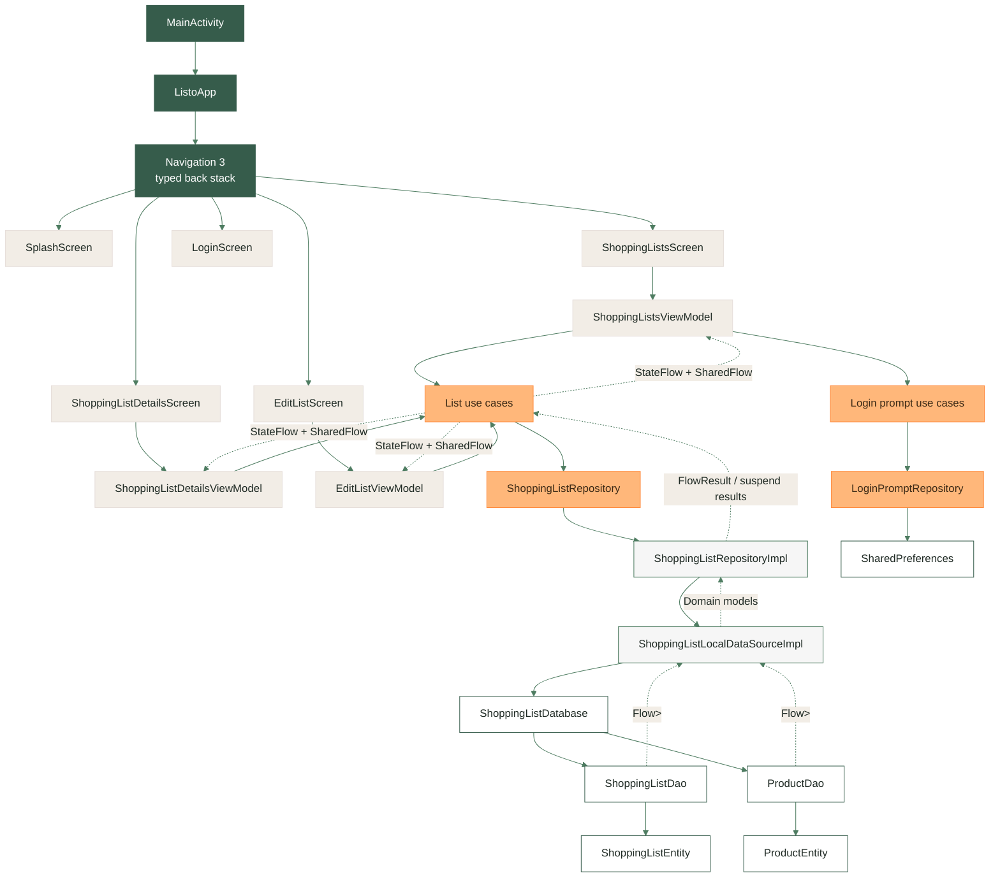
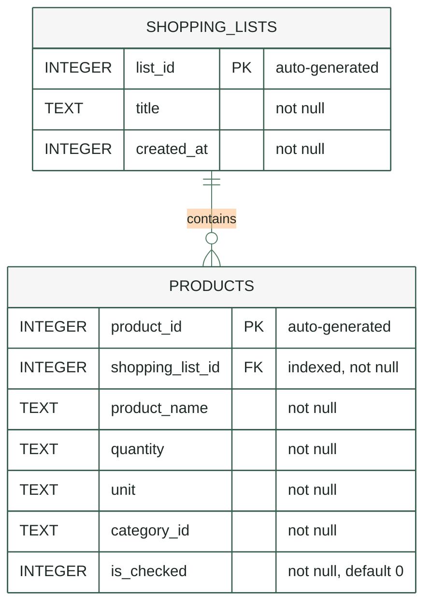

# Listo

Listo is a shopping list app designed to make grocery planning simple, organized, and reliable. It lets users create shopping lists, add products with quantities, units, and categories, review each list in detail, and mark products as checked while shopping. The current app is built around a local-first experience: lists are persisted on device with Room, exposed through reactive Kotlin Flows, and presented with a Jetpack Compose UI.

The project is also structured as a practical Android architecture sample. It uses typed Navigation 3 routes, Hilt dependency injection, ViewModels with state/result flows, a domain layer with use cases, and a Room-backed data layer that can evolve toward cloud sync in the future.

## Features

Listo currently supports:

* Creating and editing shopping lists.
* Adding products with description, quantity, unit, and category.
* Browsing all saved shopping lists ordered by creation date.
* Opening a shopping list details screen.
* Checking and unchecking products from the details screen.
* Deleting shopping lists.
* Showing a one-time login prompt, persisted with `SharedPreferences`.
* Local persistence with Room database migrations and exported schemas.

## Development Environment

Listo uses the Gradle build system and can be imported directly into Android Studio.

Recommended setup:

* Android Studio with support for the configured Android Gradle Plugin.
* JDK 11 compatibility.
* Android SDK compile version configured by the project.
* Run configuration: `app`.

Common commands:

```bash
./gradlew :app:assembleDebug
./gradlew :app:testDebugUnitTest
./gradlew detekt
```

## Tech Stack

* Kotlin
* Jetpack Compose
* Material 3
* Navigation 3
* Hilt
* Room
* Kotlin Coroutines and Flow
* Kotlin Serialization
* Lottie Compose
* Detekt
* JUnit, MockK, AndroidX testing libraries

## Architecture

Listo follows a layered Android architecture inspired by the same principles used by Now in Android: UI code is kept close to feature screens, business operations are expressed as use cases, and persistence details are hidden behind repository contracts.



The app starts in `MainActivity`, which renders `ListoApp`. `ListoApp` owns the top-level scaffold and a typed Navigation 3 back stack through `ListoNavigator`. Each feature contributes its own navigation entries, keeping routes close to the screens they open.

Presentation logic lives in feature ViewModels. Screens dispatch UI actions to their ViewModel, and the ViewModel exposes continuous UI state with `StateFlow` plus one-off navigation and message events with `SharedFlow`. ViewModels call use cases instead of reaching into persistence directly.

The domain layer defines the app operations around shopping lists: observing all lists, observing one list, creating, updating, deleting, and saving checked product state. The repository interface keeps this layer independent from Room.

The data layer binds the repository contract to local persistence. `ShoppingListLocalDataSourceImpl` coordinates Room transactions, maps entities to domain models, and uses DAOs to read and write `shopping_lists` and `products`. The login prompt is intentionally separate from the shopping-list database and is stored in `SharedPreferences`.

## Local Database

The local database is implemented with Room in `ShoppingListDatabase`. Version `2` contains two tables: `shopping_lists` and `products`. A shopping list can contain many products, and products are deleted automatically when their parent list is removed.



`shopping_lists` stores the list identity, display title, and creation timestamp. `products` stores the item data for each list: the product name, quantity, unit, category, and checked state.

The relationship is modeled through `products.shopping_list_id`, which references `shopping_lists.list_id`. Room defines this as a foreign key with `ON DELETE CASCADE` and `ON UPDATE CASCADE`, so removing a list also removes its products. The `shopping_list_id` index supports efficient reads for list details.

Room exposes list details through `ShoppingListWithProducts`, combining `ShoppingListEntity` with all related `ProductEntity` rows. The app then maps those entities into the domain models `ShoppingList` and `Product`.

Database schema files are exported under:

```text
app/schemas/com.valmiraguiar.listo.feature.lists.data.local.database.ShoppingListDatabase/
```

## UI

The UI is built entirely with Jetpack Compose and Material 3. The visual identity uses a green primary palette, warm secondary/accent tones, and the Poppins font family loaded through Google Fonts.

Main destinations:

* `SplashScreen`
* `ShoppingListsScreen`
* `ShoppingListDetailsScreen`
* `EditListScreen`
* `LoginScreen`

## Testing And Quality

The project includes unit tests and Detekt configuration.

```bash
./gradlew :app:testDebugUnitTest
./gradlew detekt
```

Detekt reports are configured under:

```text
reports/detekt/
```

## Build

Debug build:

```bash
./gradlew :app:assembleDebug
```

Release build:

```bash
./gradlew :app:assembleRelease
```

## License

Listo is distributed under the terms of the MIT License. See [LICENSE](LICENSE) for more information.
